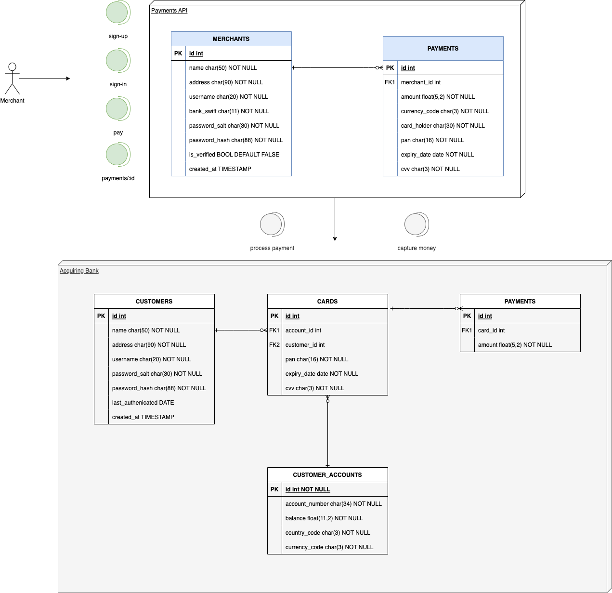
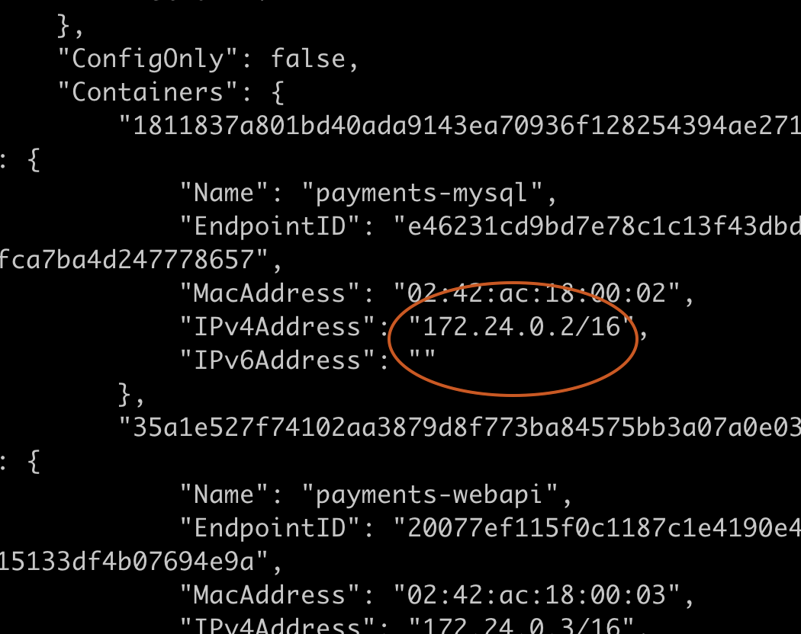
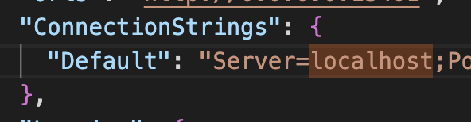

# README #

This README explains how to setup the tech challenge and run it.

### Project structure
The project has 3 root folders:

1. payments-api - source code
2. unit-tests
3. integration-tests

### How do I get set up? ###

* Required tools
* Pre-configuration
* Install
* Run
* Test
* Assumptions
* Other remarks

### Docs
#### General architecture

The following image illustrates the system high-level architecture. The Acquiring Bank part would be a possible first-phase solution that is represented by the CKO simulator currently.

#### Domain-driven architecture

The image below represents the core components of the system and its layered structure.
")

### Required tools
* dotnet
* dotnet-ef
* mysql server
* dotnet-counters (to view metrics only)

#### Run with docker
To run the project with docker:
1. `docker compose up --build`
2. Copy the MySql container ip `docker network inspect payments-tech-challenge_payments-network`

3. Change `appsettings.json` Server from localhost to the copied ip

4. Re-do docker compose

Improvement: changes should be done to run solely step 1. Steps 2 to 4 should be removed.

#### Pre-configuration

1. run `mysql.server start`
2. in mysql environment run `GRANT ALL PRIVELEGES ON *.* TO 'oscar'@'localhost'` - this privileges should be refined

#### Install
* run `export MYSQL_PASSWD=<mysql_password>` - check `appsettings.json`
* run `cd payments-api; sh tools/build.sh`
* dotnet tool install --global dotnet-counters (to view metrics only)

#### Run
* run `cd payments-api; dotnet run payments-api`

#### Test
* import Postman collection `./payments-api/tools/3rd-party-integrations/PaymentsAPI.postman_collection` to Postman:
    1. /api/auth/sign-up (POST)
    2. /api/auth/sign-in (POST)
    3. before invoke `/api/pay` please update merchant to verified state (by corresponding Id)  - using script `aux/verify-merchant.sql`
    4. /api/pay (POST)
    5. /api/payment/:paymentUUID (GET)
* For simulation purposes payment redirect is done the following way:
    * Bank A:
        * A payment whose card **starts with** `1234-12` is forwarded to bank **A**;
        * if card **finishes with digit 0 to 4** the payment gets **accepted**, otherwise it gets rejected;
    * Bank B:
        * A payment whose card **starts with** `1234-56` is forwarded to bank **B**;
        * if card **finishes with digit 0** the payment gets **accepted**, otherwise it gets rejected.

#### Assumptions
* Payments API require authentication
* All payments processing requested by merchants should be recorded with acquiring bank status
* If any bank responds to a payment request, even if it is not saved to DB, the API should gracefully handle the error and return a payment reference to the merchant (covered by unit tests)

#### Other - some notes about the tech challenge implementation
##### API Auth
 Taking into consideration this API consists in a payment gateway authentication factor is crucial to ensure identity, authenticity and at least a basic level of security. The API uses JWT-based authentication. The merchants need to sign-up, and after getting verified by the system (manual process), sign-in to obtain a valid JWT token. Only then they have the ability to emit payments to the acquiring banks and get processed payments.

##### Integration tests
The solution includes integration tests. These tests involve all API endpoints responses testing as well as database state verification.

`cd integration-tests && dotnet test`

##### Unit tests
Due to time constraints only the more important parts of business logic were tested - payments service (100%) & payments controller (not completed).

`cd unit-tests && dotnet test`

##### CKO Bank mock
The passage of payments data to the banks is done via simulation within the solution. The payments gateway has the ability to send the a payment data to individual banks (using strategy pattern). This could be easily extended to invoke an external API (real-world scenario) where the payment would be forwarded to the real Acquiring Bank web service and validated there.

##### Swagger UI
In addition to the Postman collection, Swagger UI is available in `http://localhost:13401/swagger/` with the endpoints collection.

##### Metrics logger
Start the Web API process, change to `./payments-api/` directory and:

1. get the pid - `lsof -i :13401 | grep payments -h -m 1 | awk '{print $2}'`

2. capture metrics (perform some requests):
    
    i.
        to screen: `dotnet-counters monitor --process-id <pid> --counters PaymentsAPI.EventCounter.RequestProcessingTime`

    ii.
        to file: `dotnet-counters collect --process-id <pid> --format json -o diagnostics.json --counters PaymentsAPI.EventCounter.RequestProcessingTime`
        
            View captured metrics `cat diagnostics.json | jq`

#### Possible improvements

* Client API errors should be not be mixed with API Errors. Changes in API errors (even a slight refactor in a enumeration name) shouldn't provoke breaking changs in the client;
* Review mysql user privileges;
* Remove password from code and scripts and use a secure storage;
* AuthenticationController should have input validations before calling any services layer;
* Containerization with docker;
* Extend and refine metrics.